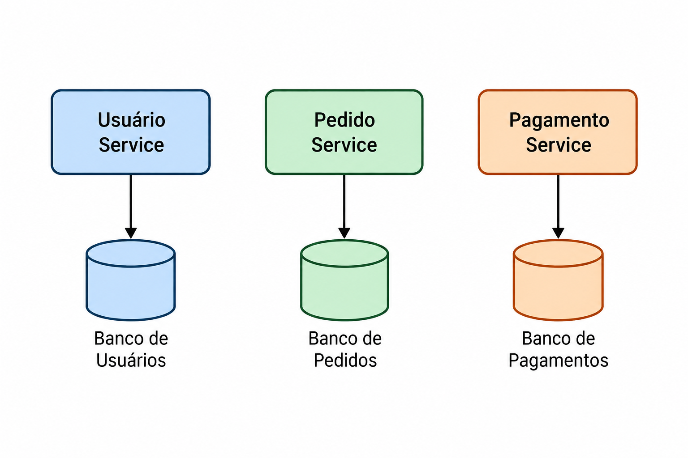

::: {.meta-topico}
<dl>
<dt>Competências</dt>
<dd>Avaliar a utilização da arquitetura de microsserviços considerando requisitos,
trade-offs e características do sistema.</dd>
<dt>Pré-requisitos</dt>
<dd>Conceitos básicos de arquitetura de software e sistemas distribuídos.</dd>
<dt>Formatos</dt>
<dd>
[texto]{.formato} [notebook](notebook.ipynb){.formato} [áudio]{.formato} [gem]{.formato} [slides](slides.qmd){.formato}
</dd>
</dl>
:::

## Definição e contexto

A arquitetura de microsserviços é um estilo arquitetural baseado na construção de sistemas 
como um conjunto de pequenos serviços independentes, cada um responsável por uma capacidade
específica do negócio e executado de forma autônoma. Esses serviços colaboram entre si por
meio de interfaces bem definidas, permitindo que sejam desenvolvidos, implantados e 
evoluídos de maneira independente [@newman2015building]. Newman define microsserviços como 
serviços pequenos e autônomos que trabalham em conjunto, enfatizando a existência 
de ciclos de vida próprios para cada serviço e a organização desses componentes em torno 
de domínios de negócio.

O surgimento dessa abordagem está relacionado aos desafios encontrados no desenvolvimento e manutenção
de sistemas monolíticos de grande escala. À medida que aplicações crescem, torna-se
comum o aumento do acoplamento entre componentes, dificultando alterações isoladas, 
evolução independente de funcionalidades e a atuação de equipes diferentes sobre o mesmo 
código. Newman destaca que sistemas monolíticos extensos podem tornar difícil identificar onde uma 
mudança deve ser realizada, pois funcionalidades relacionadas acabam espalhadas pelo código, 
aumentando a dificuldade de manutenção e evolução [@newman2015building].

Esse problema pode ser compreendido como uma dificuldade de decomposição adequada do 
sistema. Quando os módulos são organizados de forma inadequada, mudanças em uma parte da 
aplicação podem gerar impactos inesperados em outras partes, aumentando a dependência 
entre componentes. Nesse contexto, a arquitetura de microsserviços busca criar fronteiras 
mais claras entre responsabilidades, permitindo que cada serviço possua um limite bem 
definido e possa evoluir sem depender diretamente dos demais[@newman2015building]. Newman destaca que os limites 
dos microsserviços devem ser orientados por fronteiras de negócio, evitando que um serviço 
cresça excessivamente e volte a concentrar responsabilidades[@newman2015building].

Essa preocupação com a forma de dividir sistemas já era discutida por Parnas [@parnas1972modularization], ao 
propor critérios para decomposição modular. O autor argumenta que uma boa divisão de 
módulos não deve ser baseada apenas na sequência de processamento das informações, mas 
principalmente na separação de decisões de projeto que precisam permanecer ocultas dentro 
dos módulos. Dessa forma, mudanças internas em um módulo não devem exigir alterações nos 
demais componentes do sistema.

Assim, a arquitetura de microsserviços pode ser entendida como uma evolução das 
práticas de modularização, aplicando a ideia de isolamento de responsabilidades em 
uma escala maior. Enquanto módulos tradicionais buscam reduzir dependências dentro de 
uma aplicação, microsserviços utilizam fronteiras independentes de execução para permitir 
maior autonomia de desenvolvimento, implantação e evolução do sistema.

## Conceitos fundamentais de microsserviços

###Serviços pequenos e autônomos

A arquitetura de microsserviços organiza uma aplicação como um conjunto de serviços 
pequenos e independentes, cada um responsável por uma capacidade específica do negócio. 
Esses serviços possuem seu próprio processo de execução e podem ser desenvolvidos, testados, 
implantados e evoluídos de forma independente dos demais componentes do sistema [@newman2015building].


Diferentemente de uma aplicação monolítica, onde todas as funcionalidades fazem parte 
de uma única unidade de implantação, os microsserviços estabelecem limites claros 
entre as partes do sistema. Essa separação permite que alterações realizadas em um 
serviço específico tenham menor impacto sobre os demais serviços da aplicação [@newman2015building].

###Organização por capacidades de negócio

Um princípio fundamental dos microsserviços é que os serviços devem ser organizados em 
torno de capacidades de negócio, e não separados apenas por características técnicas da aplicação.
Por exemplo, em vez de dividir uma aplicação em equipes ou componentes como "interface", "banco de dados" e "lógica de aplicação", 
a arquitetura busca criar serviços relacionados ao domínio do problema:

Cliente Service

Pedido Service

Pagamento Service

Estoque Service

Essa abordagem reduz dependências entre equipes e permite que cada serviço tenha 
responsabilidade sobre uma parte específica do negócio. Fowler e Lewis destacam que os 
microsserviços são construídos em torno de funcionalidades de negócio e podem ser 
gerenciados por equipes diferentes [@fowler2014microservices].


###Autonomia dos serviços

A autonomia é uma característica central dos microsserviços. Cada serviço deve possuir 
controle sobre seu próprio ciclo de desenvolvimento e implantação, permitindo que equipes 
diferentes trabalhem e entreguem mudanças sem depender de uma coordenação constante com 
outras partes do sistema [@newman2015building].

Essa autonomia envolve:
- código independente;
- implantação independente;
- evolução independente;
- responsabilidade clara sobre uma capacidade do sistema.

Entretanto, Richardson destaca que essa autonomia traz desafios, pois a aplicação deixa de 
ser um único processo e passa a ser um sistema distribuído, exigindo mecanismos para lidar 
com comunicação, falhas e consistência dos dados [@richardson2018microservices].

### Comunicação entre serviços

Os microsserviços precisam colaborar para executar funcionalidades completas
da aplicação. Essa comunicação pode ocorrer por APIs ou mecanismos de
mensageria, introduzindo desafios relacionados à latência, disponibilidade
e falhas distribuídas [@fowler2014microservices]..

###Independência de implantação

Uma das principais características dos microsserviços é a capacidade de realizar 
implantação independente. Em uma aplicação monolítica, uma alteração normalmente exige a 
construção e implantação de todo o sistema. Já em microsserviços, uma alteração em 
determinado serviço pode ser publicada sem necessariamente modificar ou implantar os demais 
componentes [@fowler2014microservices].

Essa característica favorece:
- entregas menores e frequentes;
- redução do impacto de mudanças;
- equipes trabalhando em diferentes partes do sistema.


## Arquitetura monolítica versus microsserviços

A arquitetura monolítica representa uma abordagem na qual todos os componentes de
uma aplicação são desenvolvidos, versionados e implantados como uma única unidade.
Nesse modelo, funcionalidades como interface de usuário, regras de negócio e acesso
a dados geralmente fazem parte do mesmo processo de execução, compartilhando o
mesmo ciclo de desenvolvimento e implantação [@fowler2014microservices].

Inicialmente, essa abordagem apresenta vantagens relacionadas à simplicidade
operacional. Como toda a aplicação está concentrada em um único projeto, o
desenvolvimento, os testes e a implantação possuem menor complexidade, permitindo
que equipes pequenas construam sistemas de forma mais direta. Além disso, a
comunicação entre os componentes ocorre dentro do mesmo processo, evitando custos
relacionados à comunicação distribuída [@newman2015building].

Entretanto, conforme uma aplicação monolítica cresce, surgem dificuldades
relacionadas à manutenção e evolução do sistema. O aumento do tamanho do código
pode tornar os limites entre funcionalidades menos claros, fazendo com que mudanças
em uma determinada parte da aplicação tenham impacto em outros componentes. Dessa
forma, uma alteração aparentemente localizada pode exigir a reconstrução, teste e
implantação de toda a aplicação [@newman2015building].

Outro desafio está relacionado à escalabilidade e à organização das equipes. Em uma
aplicação monolítica, a escalabilidade normalmente ocorre considerando o sistema
como um todo, mesmo quando apenas uma funcionalidade específica apresenta maior
demanda. Além disso, equipes diferentes trabalhando sobre uma mesma base de código
podem aumentar a necessidade de coordenação e dificultar a evolução independente de
partes do sistema [@fowler2014microservices].

A arquitetura de microsserviços surge como uma alternativa para lidar com essas
limitações, propondo a decomposição da aplicação em um conjunto de serviços
independentes. Cada serviço possui uma responsabilidade bem definida, sendo
organizado em torno de uma capacidade de negócio e podendo possuir seu próprio
ciclo de desenvolvimento, implantação e evolução [@fowler2014microservices].

Essa separação permite que diferentes partes do sistema sejam modificadas e
escaladas de forma independente. Por exemplo, em uma aplicação de comércio
eletrônico, o serviço responsável por pagamentos pode receber maior capacidade de
processamento sem que seja necessário escalar também os serviços de usuários ou
produtos. Essa característica aumenta a flexibilidade da arquitetura, principalmente
em sistemas grandes e em constante evolução [@newman2015building].

A comparação entre os dois estilos pode ser observada na tabela abaixo:

| Característica | Monólito | Microsserviços |
|---|---|---|
| Estrutura | Uma única aplicação contendo todas as funcionalidades | Conjunto de serviços independentes organizados por capacidades de negócio |
| Implantação | Toda alteração exige a publicação da aplicação completa | Serviços podem ser implantados individualmente |
| Escalabilidade | Escala da aplicação como um todo | Escala apenas dos serviços que necessitam de mais recursos |
| Organização | Geralmente estruturada por camadas técnicas | Estruturada em torno de domínios e responsabilidades de negócio |
| Desenvolvimento | Maior coordenação entre equipes no mesmo código | Equipes podem trabalhar com maior autonomia |
| Complexidade | Menor complexidade operacional inicialmente | Maior complexidade devido à natureza distribuída |

Apesar dos benefícios, a adoção de microsserviços não elimina a complexidade de um
sistema, mas altera onde essa complexidade está localizada. Ao substituir uma
aplicação única por diversos serviços distribuídos, surgem novos desafios
relacionados à comunicação entre componentes, monitoramento, gerenciamento de
falhas, consistência dos dados e operação da infraestrutura [@richardson2018microservices].

Portanto, a escolha entre uma arquitetura monolítica e uma arquitetura de
microsserviços deve considerar as características do sistema, o tamanho da equipe,
os requisitos de evolução e os atributos de qualidade desejados. Microsserviços
representam uma alternativa arquitetural para determinados contextos, mas não uma
solução universal para todos os tipos de aplicações.

## Estrutura e componentes

Uma arquitetura de microsserviços divide uma aplicação em um conjunto de serviços
independentes organizados por capacidades de negócio. Cada serviço possui uma
responsabilidade bem definida, um contrato explícito de comunicação e autonomia
sobre seus dados e ciclo de vida.

Essa organização permite implantação independente, escalabilidade seletiva e
maior flexibilidade tecnológica. Entretanto, também introduz desafios relacionados
à comunicação distribuída, observabilidade, consistência de dados e gerenciamento
de falhas.

| Componente | Papel | Decisões importantes |
|---|---|---|
| Clientes | Web, mobile ou sistemas externos | contrato público e autenticação |
| API Gateway | ponto de entrada e proxy reverso | roteamento, BFF e limites |
| Microsserviço | capacidade de negócio autônoma | fronteira, contrato e ciclo de vida |
| Banco por serviço | persistência sob responsabilidade do serviço | isolamento de schema e consistência |
| Broker / Event Bus | transporte de mensagens | tópicos, filas, retenção e retry |
| Service Discovery | resolução de nomes para instâncias | registro, health checks e balanceamento |
| Observabilidade | visão do comportamento distribuído | logs, métricas e traces |

O princípio “banco por serviço” não exige um produto de banco diferente para cada serviço. 
Exige que outros serviços não leiam ou escrevam diretamente no modelo interno daquele serviço. 
A integração ocorre por API ou evento.

###Banco de dados por serviço

Um conceito frequentemente associado aos microsserviços é que cada serviço deve ser 
responsável pelos seus próprios dados. Essa abordagem evita que 
diferentes serviços dependam diretamente do mesmo 
banco de dados, reduzindo o acoplamento entre componentes.
Richardson apresenta o padrão Database per Service, no qual cada serviço possui 
controle sobre sua própria persistência, permitindo maior autonomia tecnológica e evolução 
independente [@richardson2018microservices].



## Como decompor o sistema

Comece pelo domínio, não pela infraestrutura:

1. liste capacidades e fluxos de negócio;
2. agrupe regras que mudam juntas;
3. defina o que cada serviço possui e o que ele não conhece;
4. publique contratos pequenos e orientados a casos de uso;
5. valide fronteiras com cenários de mudança e falha.

Um serviço não precisa ser minúsculo: precisa ser coeso, autônomo e operável. 
Uma decomposição que exige chamadas síncronas em cadeia para qualquer operação 
provavelmente criou fronteiras artificiais.


### Comunicação entre serviços

Há dois eixos úteis: **síncrono ou assíncrono** (o consumidor espera ou processa depois) e 
**um receptor ou vários** (destinatário único ou assinantes). Em sistemas reais, os estilos 
convivem.

A recomendação é manter o caminho síncrono curto e usar eventos para propagar fatos que 
não precisam bloquear a resposta original. A documentação da Microsoft sobre comunicação 
em microsserviços descreve HTTP/HTTPS, REST e mensageria como 
combinações comuns [@microsoft-communication].


### APIs REST

REST sobre HTTP é apropriado para consultas e comandos que precisam de resposta rápida:

- `GET /produtos/{id}` consulta um recurso;
- `POST /pedidos` cria uma intenção de pedido;
- códigos HTTP, payloads e erros formam parte do contrato;
- OpenAPI documenta, valida e ajuda a gerar clientes.

Para reduzir acoplamento, prefira contratos orientados a recursos, 
versionamento compatível e idempotência onde houver retry. Defina timeout em 
toda chamada remota; retry sem limite pode transformar uma falha local em uma tempestade.

### O risco da cadeia síncrona

`Gateway → Pedidos → Pagamento → Estoque → Notificações` multiplica latência e pontos de falha. 
Se uma etapa puder acontecer depois, publique `PedidoCriado` e responda com um estado explícito, 
como `PROCESSANDO`.

### Mensageria e eventos

Mensageria permite trocar mensagens por filas ou tópicos sem manter os serviços conectados 
durante todo o processamento. Um produtor publica um evento; consumidores independentes reagem 
a ele.

{#fig-comunicacao fig-align="center"}

Use mensageria para processamento demorado, integração com múltiplos consumidores, 
absorção de picos e propagação de mudanças. Inclua identificador de correlação, versão 
do evento, chave de ordenação quando necessária, consumidor idempotente, retry e fila de 
mensagens não processáveis.

{#fig-comunicacao fig-align="center"}

### API Gateway

O API Gateway é uma entrada controlada entre clientes e serviços. 
Pode terminar TLS, autenticar, aplicar limites, rotear versões, agregar respostas e 
adaptar o contrato para um cliente — o padrão **Backend for Frontend (BFF)**.

Ele reduz o acoplamento do cliente à topologia interna, mas não deve concentrar 
regras de negócio. Monitore sua latência, disponibilidade e comportamento sob falha. 
A referência da Azure sobre API gateways detalha autenticação, SSL, mTLS, rate limiting e 
roteamento [@azure-gateway].

### Service Discovery

Em ambientes com containers, réplicas podem surgir, desaparecer e mudar de endereço. 
Service Discovery resolve um nome lógico — por exemplo, `pedidos` — para instâncias 
disponíveis (`host`, porta e metadados), normalmente com health checks e expiração de registros.

Há duas formas: **client-side discovery**, em que o cliente consulta o registry, e 
**server-side discovery**, em que gateway, proxy ou load balancer faz a consulta. 
O segundo modelo esconde a topologia dos clientes e combina 
com um gateway [@microservices-discovery].

Discovery não substitui resiliência: chamadas ainda precisam de timeout, 
retry limitado, circuit breaker e fallback quando fizer sentido.


## Exemplo aplicado

Para demonstrar a aplicação da arquitetura de microsserviços, considere uma
plataforma de comércio eletrônico responsável por gerenciar clientes, pedidos,
pagamentos e estoque.

Em uma aplicação monolítica, essas funcionalidades poderiam estar reunidas em
uma única aplicação. Nesse cenário, uma alteração no módulo de pagamentos, por
exemplo, poderia exigir a construção, teste e implantação de todo o sistema.

Na abordagem de microsserviços, o sistema pode ser dividido em serviços
organizados de acordo com as principais capacidades do negócio:

- **Usuário Service**: responsável pelo cadastro e gerenciamento dos clientes;
- **Pedido Service**: responsável pela criação e acompanhamento dos pedidos;
- **Pagamento Service**: responsável pelo processamento dos pagamentos;
- **Estoque Service**: responsável pelo controle da disponibilidade dos produtos.

Cada serviço possui uma responsabilidade específica e pode evoluir de forma
independente dos demais.

### Estrutura do sistema

A estrutura simplificada pode ser representada da seguinte forma:

```text
                         Cliente
                            |
                            v
                      API Gateway
                            |
              +-------------+-------------+
              |             |             |
              v             v             v
       Usuário Service  Pedido Service  Pagamento Service
              |             |             |
              v             v             v
       Banco Usuários  Banco Pedidos  Banco Pagamentos
                            |
                            v
                      Estoque Service
                            |
                            v
                      Banco Estoque

:::

## Trade-offs

A arquitetura de microsserviços não deve ser entendida como uma solução que
simplesmente reduz a complexidade de uma aplicação. Sua adoção modifica a forma
como essa complexidade é distribuída pelo sistema. Benefícios como fronteiras
modulares mais fortes, implantação independente e autonomia tecnológica são
acompanhados por custos relacionados à comunicação distribuída, consistência de
dados e operação de múltiplos serviços [@newman2015building;
@richardson2018microservices].

### Benefícios

Um dos principais benefícios está nas **fronteiras modulares**. Ao separar a
aplicação em serviços, cada unidade passa a possuir uma responsabilidade mais
delimitada, dificultando que outros componentes acessem diretamente sua
implementação interna. Essa separação pode facilitar a manutenção e permitir
que diferentes equipes trabalhem em partes distintas do sistema [@fowler2014microservices].

Outro benefício é a **implantação independente**. Como os serviços são unidades
separadas, uma alteração pode ser publicada sem necessariamente reconstruir e
implantar toda a aplicação. Para que isso funcione, os contratos entre os
serviços precisam ser mantidos de forma compatível [@newman2015building].

Os microsserviços também permitem **diversidade tecnológica**. Serviços
diferentes podem utilizar linguagens, frameworks ou tecnologias de
armazenamento distintas quando houver uma justificativa para essa escolha
[@fowler2014microservices].

A arquitetura também possibilita **escalabilidade seletiva**. Em vez de
aumentar os recursos de toda a aplicação, serviços que apresentam maior demanda
podem receber mais instâncias ou recursos. Essa possibilidade, entretanto, não
significa que a escalabilidade seletiva será sempre mais eficiente que escalar
uma aplicação monolítica; o benefício depende das características do sistema
[@fowler2014microservices].

### Custos e desafios

O principal custo introduzido pelos microsserviços está relacionado à
**distribuição**. Em uma aplicação executada em um único processo, uma chamada
entre componentes ocorre localmente. Em uma arquitetura distribuída, a
comunicação entre serviços ocorre pela rede e pode sofrer com latência,
indisponibilidade ou falhas de comunicação [@richardson2018microservices].

A **consistência dos dados** também se torna mais complexa. Como os dados podem
estar distribuídos entre diferentes serviços, uma operação de negócio pode
envolver múltiplos modelos de dados. Nesse cenário, manter uma única transação
abrangendo todos os serviços pode ser mais difícil, exigindo mecanismos
específicos para coordenar operações distribuídas [@richardson2018microservices].

Outro custo é a **complexidade operacional**. Uma aplicação monolítica pode
envolver um número relativamente pequeno de processos, enquanto uma arquitetura
de microsserviços pode possuir dezenas ou centenas de serviços. Isso aumenta a
necessidade de automação, monitoramento, logs, métricas, rastreamento distribuído
e processos confiáveis de implantação [@newman2015building].

A **testabilidade** também apresenta novos desafios. Testar cada serviço
isoladamente pode ser relativamente simples, mas testar comportamentos que
atravessam vários serviços exige verificar contratos e interações entre
componentes. Newman destaca que testes de sistemas distribuídos exigem
estratégias diferentes das utilizadas em aplicações monolíticas
[@newman2015building].

Além disso, a decomposição pode criar problemas quando as fronteiras dos
serviços são mal definidas. Serviços excessivamente dependentes podem formar
cadeias de chamadas ou exigir alterações coordenadas, reduzindo justamente a
autonomia que a arquitetura procura proporcionar [@fowler2014microservices].

### Comparação dos principais trade-offs

| Aspecto | Possível benefício | Custo ou desafio |
|---|---|---|
| Modularidade | Fronteiras mais claras entre responsabilidades | Fronteiras mal definidas podem aumentar o acoplamento |
| Implantação | Serviços podem ser implantados independentemente | Exige automação e contratos compatíveis |
| Escalabilidade | Possibilidade de escalar serviços individualmente | A infraestrutura necessária aumenta |
| Tecnologia | Diferentes tecnologias podem ser utilizadas | Diversidade excessiva aumenta a complexidade operacional |
| Comunicação | Serviços podem evoluir de forma independente | Comunicação pela rede adiciona latência e pontos de falha |
| Dados | Cada serviço pode controlar seus próprios dados | Consistência entre serviços torna-se mais complexa |
| Testes | Serviços podem ser testados isoladamente | Testes de integração e ponta a ponta tornam-se mais complexos |
| Operação | Serviços menores podem ser gerenciados separadamente | Monitoramento, logs e deploys tornam-se mais numerosos |

Portanto, o principal trade-off dos microsserviços está entre **autonomia e
complexidade distribuída**. A arquitetura pode favorecer sistemas que precisam
de evolução independente, diferentes equipes ou escalabilidade específica por
capacidade, mas exige maior maturidade para lidar com comunicação, dados,
testes e operação distribuída [@newman2015building; @richardson2018microservices].

A escolha da arquitetura deve, portanto, considerar o contexto do sistema. A
adoção de microsserviços para uma aplicação pequena ou com poucas necessidades
de evolução independente pode introduzir custos que não seriam necessários em
uma arquitetura monolítica. Fowler destaca que os benefícios e custos devem ser
avaliados de acordo com as características específicas de cada sistema
[@fowler2014microservices].

## Quando usar e quando não usar

Feche com critérios de decisão acionáveis, na forma de condições verificáveis, não
de recomendações vagas.

**Considere usar quando:**

- Sistema grande e domínio complexo
- Necessidade de releases frequentes e independentes por área.
- Partes do sistema escalam de formas muito diferentes.
- Múltiplos times que precisam de autonomia real.
- Infraestrutura madura: CI/CD, containers, observabilidade.

**Evite quando:**

- Time pequeno ou produto em estágio inicial.
- Domínio fortemente acoplado, com dados entrelaçados.
- Sem cultura e ferramentas de DevOps.
- Requisitos fortes de consistência imediata entre módulos.
- Adoção por moda, sem dor real de negócio.

### Critérios de decisão

| Pergunta | Preferência inicial |
|---|---|
| O consumidor precisa do resultado nesta interação? | HTTP/REST síncrono |
| O trabalho é demorado ou pode terminar depois? | fila ou evento assíncrono |
| Existem vários interessados em uma mudança? | publish/subscribe |
| Há vários tipos de cliente? | gateway ou BFF por experiência |
| As instâncias mudam dinamicamente? | registry + health checks |
| A chamada pode falhar ou atrasar? | timeout, retry limitado, circuit breaker e trace |


## Referências

::: {#refs}
:::

