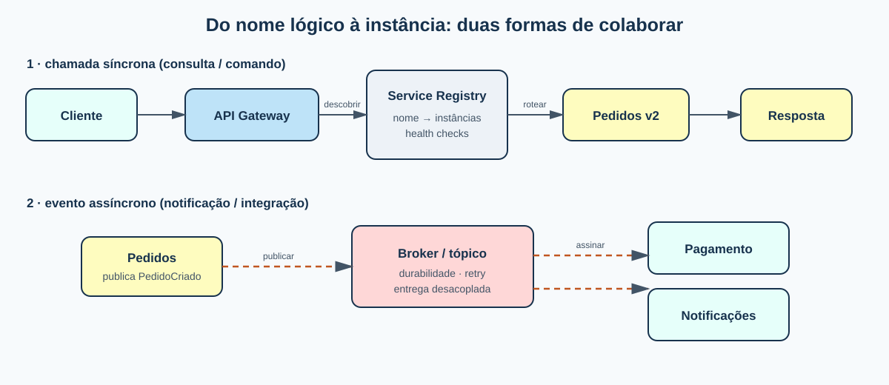

```qmd
---
title: "Arquitetura de microsserviços"
subtitle: "Componentes, comunicação e descoberta"
author: 
  - name: "Agdo José Samuel Sousa de oliveira"
  - name: "Antonio Carlos Verissimo de Souza"
  - name: "Pedro Henrique Borges Silva"
  - name: "Felipe dos Santos Silva"
  - name: "Antonio Pedro Guimarães Santos de Macedo"
bibliography: referencias.bib
format:
  revealjs:
    slide-number: true
    transition: slide
    lang: pt-BR
---

## O problema

- Um sistema cresce além de um único deploy.
- Times precisam evoluir partes diferentes com autonomia.
- Rede, dados e falhas passam a ser parte do design.

## O que é um microsserviço?

Uma unidade pequena e autônoma, organizada em torno de uma capacidade de negócio, com:

- processo e deploy independentes;
- contrato explícito;
- responsabilidade pelo próprio estado;
- equipe capaz de operar o serviço.

> O tamanho é um sinal; a fronteira de negócio e a autonomia são os critérios.

## Visão da arquitetura

{fig-alt="Arquitetura de referência de microsserviços"}

## Componentes e responsabilidades

| Componente | Responsabilidade |
|---|---|
| API Gateway | entrada, autenticação, roteamento, composição e limites |
| Serviço | regra de negócio, contrato e dados do seu domínio |
| Broker | filas/tópicos, entrega assíncrona e desacoplamento temporal |
| Service Discovery | nome lógico, instâncias e saúde |
| Observabilidade | logs, métricas e traces correlacionados |

## API REST: quando usar

- consultas interativas e comandos que precisam de resposta rápida;
- recursos e verbos HTTP bem definidos;
- idempotência, timeouts, versionamento e erros padronizados;
- OpenAPI como contrato verificável.

**Risco:** uma cadeia longa de chamadas síncronas acopla disponibilidade e latência.

## Mensageria: quando usar

- eventos de domínio e tarefas demoradas;
- integração publish/subscribe com vários consumidores;
- absorção de picos com filas;
- retry, dead-letter queue e consumidores idempotentes.

**Risco:** consistência eventual, ordenação, duplicatas e rastreabilidade exigem projeto explícito.

## Gateway e Service Discovery

{fig-alt="Comunicação síncrona e descoberta de serviços"}

O gateway esconde a topologia interna. O registry resolve o nome lógico para uma instância saudável; nenhum cliente deve depender de IPs efêmeros.

## Deploy independente

No monólito, mudar uma função exige rebuildar e reimplantar tudo.

No microsserviço, só o serviço afetado é reimplantado.

- **Releases mais rápidos** — ciclos curtos por serviço.
- **Menor risco por release** — blast radius reduzido.
- **Falha isolada** — com circuit breaker, um serviço fora do ar não propaga o caos.
- **Escala sob demanda** — só o serviço quente cresce.

> É a fonte de quase todos os outros benefícios — e também do custo operacional.

## Consistência de dados

- Cada serviço tem seu **próprio banco** — não há transação ACID global.
- Operações de negócio atravessam vários serviços e vários bancos.
- Solução comum: **Saga Pattern** — transações locais + compensações.
- Resultado: **consistência eventual**, não imediata.
- Consequência: regras de negócio ficam mais complexas e explícitas.

## Complexidade distribuída

Chamar outro serviço não é chamar uma função: é uma **chamada de rede**.

- Pode falhar, atrasar, duplicar ou chegar fora de ordem.
- Exige **timeout, retry limitado, circuit breaker e fallback**.
- Exige **service discovery** e **health checks**.
- Exige **observabilidade correlacionada** (logs, métricas, traces).

> A complexidade não desaparece: ela migra do código para a operação.

## Vantagens

- **Deploy independente** — cada serviço sobe sozinho, sem rebuildar o sistema todo.
- **Escala independente** — escala só o serviço sob carga, não a aplicação inteira.
- **Autonomia de times** — cada equipe é dona do ciclo de vida do seu serviço.
- **Isolamento de falhas** — a queda de um serviço não derruba necessariamente os demais.
- **Heterogeneidade técnica** — cada serviço pode usar a stack mais adequada.
- **Código pequeno e focado** — mais fácil de entender, testar e evoluir.

## Desvantagens

- **Complexidade distribuída** — rede, latência, timeout, retry, service discovery, tracing.
- **Consistência de dados** — sem ACID entre serviços; exige Saga e consistência eventual.
- **Custo operacional alto** — CI/CD, containers, observabilidade, on-call por serviço.
- **Debug e testes mais difíceis** — um request atravessa vários serviços.
- **Risco de "monólito distribuído"** — se as fronteiras forem mal desenhadas, é o pior dos dois mundos.

> Microsserviços trocam complexidade de código por complexidade de operação. A pergunta não é "é melhor?", é "meu contexto paga esse preço?"

## Decisão prática

1. O consumidor precisa da resposta agora? Comece com REST.
2. Pode concluir depois ou há vários interessados? Publique um evento.
3. Há múltiplos clientes e políticas comuns? Use gateway/BFF.
4. As instâncias mudam? Adote discovery e health checks.
5. Há chamadas remotas? Defina timeout, retry limitado, circuit breaker e trace.

## Fechamento

Microsserviços não são “mais APIs”. São fronteiras de negócio operáveis de forma independente.

O ganho aparece quando autonomia, contratos e operação são desenhados juntos.

## Fontes

- Microsoft — Communication in a microservice architecture [@microsoft-communication]
- Microsoft — Microservices architecture style [@azure-microservices]
- Microsoft — API gateways [@azure-gateway]
- microservices.io — Server-side discovery [@microservices-discovery]
```