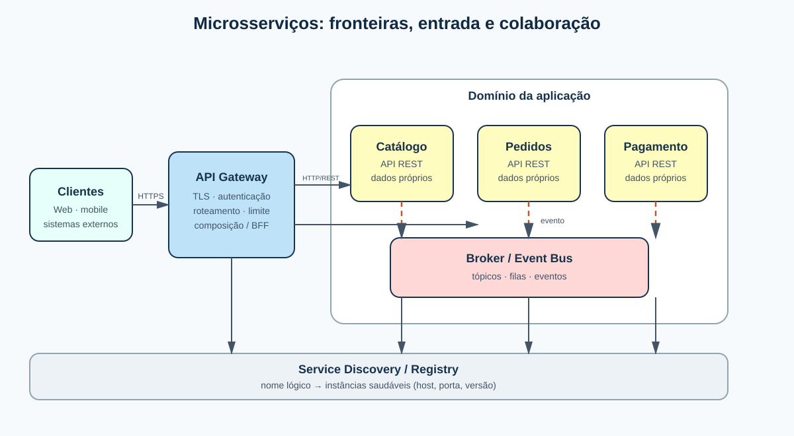

## O problema

- Um sistema cresce além de um único deploy.
- Times precisam evoluir partes diferentes com autonomia.
- Rede, dados e falhas passam a ser parte do design.

## O que é um microsserviço?

Uma unidade pequena e autônoma, organizada em torno de uma capacidade de negócio, com:

- processo e deploy independentes;
- contrato explícito;
- responsabilidade pelo próprio estado;
- equipe capaz de operar o serviço.

> O tamanho é um sinal; a fronteira de negócio e a autonomia são os critérios.

## Visão da arquitetura

{fig-alt="Arquitetura de referência de microsserviços"}

## Componentes e responsabilidades

| Componente | Responsabilidade |
|---|---|
| API Gateway | entrada, autenticação, roteamento, composição e limites |
| Serviço | regra de negócio, contrato e dados do seu domínio |
| Broker | filas/tópicos, entrega assíncrona e desacoplamento temporal |
| Service Discovery | nome lógico, instâncias e saúde |
| Observabilidade | logs, métricas e traces correlacionados |

## API REST: quando usar

- consultas interativas e comandos que precisam de resposta rápida;
- recursos e verbos HTTP bem definidos;
- idempotência, timeouts, versionamento e erros padronizados;
- OpenAPI como contrato verificável.

**Risco:** uma cadeia longa de chamadas síncronas acopla disponibilidade e latência.

## Mensageria: quando usar

- eventos de domínio e tarefas demoradas;
- integração publish/subscribe com vários consumidores;
- absorção de picos com filas;
- retry, dead-letter queue e consumidores idempotentes.

**Risco:** consistência eventual, ordenação, duplicatas e rastreabilidade exigem projeto explícito.

## Gateway e Service Discovery

{fig-alt="Comunicação síncrona e descoberta de serviços"}

O gateway esconde a topologia interna. O registry resolve o nome lógico para uma instância saudável; nenhum cliente deve depender de IPs efêmeros.

## Decisão prática

1. O consumidor precisa da resposta agora? Comece com REST.
2. Pode concluir depois ou há vários interessados? Publique um evento.
3. Há múltiplos clientes e políticas comuns? Use gateway/BFF.
4. As instâncias mudam? Adote discovery e health checks.
5. Há chamadas remotas? Defina timeout, retry limitado, circuit breaker e trace.

## Fechamento

Microsserviços não são “mais APIs”. São fronteiras de negócio operáveis de forma independente.

O ganho aparece quando autonomia, contratos e operação são desenhados juntos.

## Fontes

- Microsoft — Communication in a microservice architecture [@microsoft-communication]
- Microsoft — Microservices architecture style [@azure-microservices]
- Microsoft — API gateways [@azure-gateway]
- microservices.io — Server-side discovery [@microservices-discovery]
